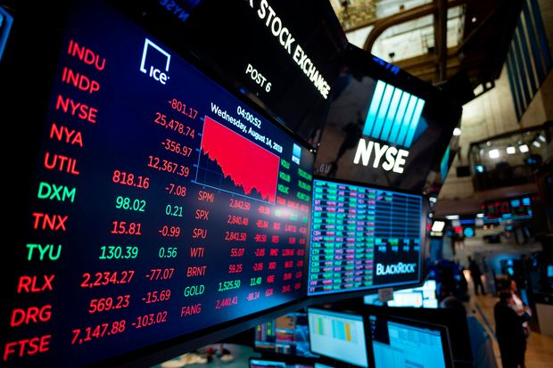

```{r setup, include=FALSE}
library(knitr)
library(rmdformats)
library(reshape2)
library(stargazer)
library(tidyverse)
library(zoo)
library(RcppEigen)
library(gridExtra)
library(jtools)
library(naniar)
library(data.table)
library(kableExtra)

## Global options
options(max.print="75")
opts_chunk$set(echo=TRUE,
               cache=TRUE,
               prompt=FALSE,
               tidy=TRUE,
               comment=NA,
               message=FALSE,
               warning=FALSE)
opts_knit$set(width=75)
```

```{r echo = FALSE}
move.col <- function(df, move_this, next_to_this, before = FALSE) {
  if (before==FALSE)
    df[,c(match(setdiff(names(df)[1:which(names(df)==next_to_this)],move_this),names(df)),
          match(move_this,names(df)),
          match(setdiff(names(df)[which(names(df)==next_to_this):ncol(df)],c(next_to_this,move_this)),names(df)))]
  else
    df[,c(match(setdiff(names(df)[1:(which(names(df)==next_to_this))],c(next_to_this,move_this)),names(df)),
          match(move_this,names(df)),
          match(setdiff(names(df)[(which(names(df)==next_to_this)):ncol(df)],move_this),names(df)))]
}
```



# Why?

Newspapers, news, and journals are all important references when investing in the stock market.  
In order to keep up with the fluctuating market, one must invest hours and hours regularly.
<br>
But what if you create a program to predict stock prices? Understanding the variables involved might help predict the market. 
<br>
This is not an original idea; in fact, many investment firms have them implemented already.
<br>
There are too many of these variables. 
<br>
This project aims to find the most signifcant variable for different stocks and markets.  

# Goal

Discover statistically significant variables in each group

# Data Gathering

The code for crawling is in the same folder on github.

## Stock 

Data contains the stock price by date for each firm. It contains data from September 16, 2010.
Stock crawled from: 

> https://finance.naver.com/item/sise.nhn?code=093370  

```{r stockdata}
setwd("data")
stockNfirm <- readRDS("stockAndFirms.rds")
stockNfirm %>% head() %>% kable %>% kable_styling(bootstrap_options = "striped", full_width = F)
```

# Data Wrangling

Data of local firms and foreign stock exchanges. 
```{r}
stockNfirm %>% 
  dplyr::select(c(2:11)) %>% 
  head() %>% 
  kable() %>% kable_styling(bootstrap_options = "striped", full_width = F)
# stockNfirm %>% 
#   dplyr::select(c(2:11)) %>% 
#   tail() %>% 
#   kable() %>%  kable_styling(bootstrap_options = "striped", full_width = F)
```

This graph visualizes the missing values in the dataset. Rows with missing values are mostly weekends, when the stock market does not operate. Different countries have different holidays, resulting different missing values in the dataset.
```{r}
naniar::vis_miss(stockNfirm[c(2:11)])
```
The graph below depicts the data after deleting rows when the entire row is empty. 5.4% of the missing values will be replaced with the Last Value Carry Forward method because stock prices are continuous. 
```{r}
stockNfirm <- stockNfirm[rowSums(is.na(stockNfirm)) != ncol(stockNfirm) - 1 , ]
naniar::vis_miss(stockNfirm[c(7:11)])
```


The 0 indicates no more missing value. 
```{r}
# Converting all NaNs to NA ----
stockNfirm[,-1] <- sapply(stockNfirm[,-1], function(x) ifelse(is.nan(x), NA, x))

# Last Value Carry Forward ----
stockNfirm <- na.locf(stockNfirm)
sum(is.na(stockNfirm$samsung))
```

## Stock Prices of Korean Corporation

The graph belows depicts the change in stock prices of Korean corporations in Kospi. The different prices of different stocks is hard to compare. Data should be normalized. These are the dependent variables.
```{r}
aaa <-melt(stockNfirm[c(1, 7:ncol(stockNfirm))],id.vars="date")
aaa <- aaa %>% 
  dplyr::filter(variable != "samsungWu")
ggplot(aaa ,aes(date,value,color=variable))+geom_line() + ggtitle("Stock Prices of Korean Corporate Giants")+ylab("Price")

```

## Stock Prices of Stock Indicies

The graph below illustrates the indices of some of world's major stock indices. These will be the indepdent variable and the standard for comparison. Likewise, these data shouled be normalized. 
```{r}
# index
five.index.long<-melt(stockNfirm[1:6],id.vars="date")
ggplot(five.index.long,aes(date,value,color=variable))+geom_line()+ggtitle("Prices of Major Stock Indices")
```


In May 1st, 2018, Samsung split their stock by 50. It led to the decrease in the price of their stock, as seen in the first graph. For a continuous trend, the rest of the stocks were split.
```{r}
# Deleting commas in numbers and converting char vectors to numeric vectors ----
for(i in 2:ncol(stockNfirm)){
  stockNfirm[ ,i] <- stockNfirm[ ,i] %>% 
    as.character() %>% 
    stringr :: str_remove_all(pattern = ',') %>% 
    as.numeric(stockNfirm[ ,i])
}
par(mfrow = c(2,1))
plot(stockNfirm$samsung,ylab = ("price"))
?plot
stockNfirm <- dplyr::mutate(stockNfirm, 
                            samsung = ifelse(samsung > 500000,
                            samsung/50,
                            samsung))
plot(stockNfirm$samsung, ylab = ("price"))
```
From an investment perspective, the percentage change of the stock is important. To compare stocks with different price, they were all normalized by the respective value of the same day to represent a percentage. Then, the stock value of the previous day was subtracted from all cells to observe the percentage change daily. 
To measure the change of different stocks,

### Normalization
* Date to normalize : 2010-09-16.
<br>
This date was used because it is the first date in the dataset. 
```{r}
stockNfirm[1,c(1, 7:ncol(stockNfirm))]
```


```{r}
percent_stockNfirm <- stockNfirm[,-1]
percent_stockNfirm <- percent_stockNfirm / percent_stockNfirm[1, ,drop = TRUE]
date <- stockNfirm[,1]
percent_stockNfirm <- cbind(date, percent_stockNfirm)
percent_stockNfirm[c(1,7:11)] %>% head() %>% kable() %>% kable_styling(bootstrap_options = "striped", full_width = F)

percent_stockNfirm[c(1:6)] %>% head() %>% kable() %>% kable_styling(bootstrap_options = "striped", full_width = F)
```
### Percentage Change
Subtracts the percentage of the previous day to indicate daily change.
```{r}
percent_diff_stockNfirm <- percent_stockNfirm[,-1]
percent_diff_stockNfirm <-  data.frame(diff(as.matrix(percent_diff_stockNfirm), lag = 1))
date_diff <- stockNfirm[-1,1]
percent_diff_stockNfirm <- cbind(date_diff, percent_diff_stockNfirm)

ggpplot_percent_diff_stockNfirm <-melt(percent_diff_stockNfirm[c(1, 7:ncol(percent_diff_stockNfirm))],id.vars="date_diff")
ggpplot_percent_diff_stockNfirm <- ggpplot_percent_diff_stockNfirm %>% 
  dplyr::filter(variable != "samsungWu")
```


```{r}
percent_stockNfirm %>% 
  dplyr::select(c(1, 7:11)) %>% 
  head()
```

# Visualization

```{r}
aaa <-melt(percent_stockNfirm[c(1, 7:ncol(percent_stockNfirm))],id.vars="date")
aaa <- aaa %>% 
  dplyr::filter(variable != "samsungWu")
ggplot( aaa ,aes(date,value,color=variable))+geom_line()
```

As the face of Korean firms, Samsung's stock was taken as an example.
```{r}
summary(percent_diff_stockNfirm$samsung, digits = 20)
```
Though a high percentage of daily change is insignificant as 0, the imbalance of more positive count led to increase in Samsung's stock price.
```{r}
percent_diff_stockNfirm %>% 
  ggplot(mapping = aes(x = samsung))+
  geom_histogram(bins = 50, col = "darkgreen")+
  xlab("Change in Samsung Stock") +
  labs(title = "Histogram of the daily change in Samsung's Stock the Past Decade") +
  theme(title = element_text(hjust = 0.5))


```
The box plot below illustrates the frequency of daily percentage change of other firms. It is noticable that celltrion is an extreme outlier. As a biopharmaceutical firm, its stock rose after earning approval to sell a biosimilar drug in the U.S.. 
```{r}
ggpplot_percent_diff_stockNfirm  %>% 
  ggplot2::ggplot(mapping = aes(y = value, fill = variable)) +
  ggplot2::geom_boxplot(alpha = 0.75) + 
  ggplot2::theme_classic() +
  ggplot2::labs(
                y = "Change in stock") +
  ggplot2::theme(axis.title.y = element_text(angle = 0,
                                             vjust = 0.5))
```
A clearer change could be seen after the outlier is removed. 
```{r}
without_celltrion <- ggpplot_percent_diff_stockNfirm %>% dplyr::filter(variable != "celltrion")

without_celltrion  %>% 
  ggplot2::ggplot(mapping = aes( y = value, fill = variable)) +
  ggplot2::geom_boxplot(alpha = 0.75) + 
  ggplot2::theme_classic() +
  ggplot2::labs(
                y = "Change in stock") +
  ggplot2::theme(axis.title.y = element_text(angle = 0,
                                             vjust = 0.5))

```

```{r}
five.index.long<-melt(percent_diff_stockNfirm[1:6],id.vars="date_diff")
ggplot(five.index.long,aes(date_diff,value,color=variable))+geom_line()+ggtitle("Prices of Major Stock Indices")

```
# Other Indepedent Variables

Other independent variables below were compared to the corporations above.
<br>
<br>

1. Foreign Exchange
<br>
&nbsp;&nbsp;&nbsp;&nbsp;Will be fixed.
2. Transaction Amount

<br>
Though the data for transaction amount can be obtained through Korean Home Trading System (HTS), there was an API error.
&nbsp;&nbsp;&nbsp;&nbsp;Will be fixed.
<br>
3. Naver Stock Forum

<br>
Analyzing the comments left under certain stock forums is rumored to effect stock prediction. Due to lack of text mining skills, this method was not approached.
&nbsp;&nbsp;&nbsp;&nbsp;Will be fixed.
<br>


4. Security Firm's Annual Reports (hkcensus, paxnet)
<br>
Analyists' profession reports attract attention and thus affect the market.Due to lack of text mining skills, this method was not approached.
&nbsp;&nbsp;&nbsp;&nbsp;Will be fixed. 

```{r}
trading_volumes <- read_csv(file = "/Users/raphael0925/FastCampus/regressionProject/finalRegression/data/Net_Purchase_By_Date_Kospi.csv")


trading_volumes[,2] <- trading_volumes[["date"]] %>% as.Date(format = "%y.%m.%d")

trading_volumes[,3:5] <- trading_volumes[,3:5] %>% 
  map(str_remove_all, pattern = ',') %>% 
  map(as.numeric)

trading_volumes <-  trading_volumes [-1]

stockNfirm <- stockNfirm %>% 
  dplyr::select(samsung:skt, everything())

stockNfirm <- stockNfirm %>%
  dplyr::left_join(trading_volumes, by = "date") %>%
  na.locf()

```
## 회귀분석

```{r}

nine.companies.long<-melt(stockNfirm[c(1,7:ncol(stockNfirm))],id.vars="date")

ggplot(stockNfirm,aes(date, samsung)) +
geom_line() 

```


```{r samsunng}

samsung_multifit <- lm(samsung ~ . , data = stockNfirm[-(2:11)])
summ(samsung_multifit)
summary(samsung_multifit)
# graph of error
# plot(multifit)

```

```{r samsungGraph}
q <- effect_plot(samsung_multifit, pred = kospi, interval = TRUE, plot.points = TRUE)
q1 <- effect_plot(samsung_multifit, pred = sse, interval = TRUE, plot.points = TRUE)
q2 <- effect_plot(samsung_multifit, pred = dji, interval = TRUE, plot.points = TRUE)
q3 <- effect_plot(samsung_multifit, pred = nikkei, interval = TRUE, plot.points = TRUE)
q4 <- effect_plot(samsung_multifit, pred = kosdaq, interval = TRUE, plot.points = TRUE)
q5 <- effect_plot(samsung_multifit, pred = Individual, interval = TRUE, plot.points = TRUE) 
q6 <- effect_plot(samsung_multifit, pred = Foreigner, interval = TRUE, plot.points = TRUE)
q7 <- effect_plot(samsung_multifit, pred = Institution, interval = TRUE, plot.points = TRUE)
grid.arrange(q,q1,q2,q3, ncol = 2, nrow = 2)
grid.arrange(q4,q5,q6,q7, ncol = 2, nrow = 2)
```


```{r}
# singlefit <- lm(samsung ~ kospi, data = stockPercent)
# summ(singlefit)

# effect_plot(multifit, pred = kospi, interval = TRUE, plot.points = TRUE)
# effect_plot(multifit, pred = sse, interval = TRUE, plot.points = TRUE)

# effect_plot(singlefit, pred = kospi, interval = TRUE, plot.points = TRUE)
```
